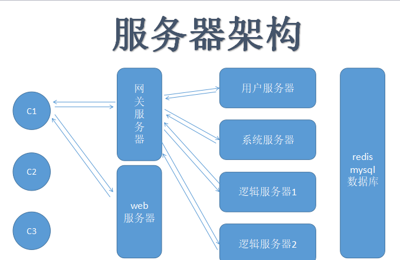

# 服务器架构 

## 服务器的架构

## 高效的服务器

- 算法比较好，时间，空间复杂度比较稳定

- 不傻等在一个事务上处理，等待一个事务的同时，可以响应另外一个事务(异步)

- 发挥多核优势，多线程，多个核，可以同时执行多个线程/进程，不让cpu休息

- 独立拆分模块(可扩容)

## 内存管理

- 内存碎片

1. 内存碎片产生的原因 
2. 根据用户规模预先分配出来
3. 内存占用尽可能的要稳定、可控
4. 控制动态分配内存的颗粒度(16,32,64,128,1024,4096)

- 根据业务来定义内存分配器

1. 根据预判的用户规模，来分配好对应的内存池
2. 内存池内的对象，可以重复利用，提高malloc效率

- 内存管理设计和实现(c 和 c++ 同时支持)

1.

## NetBus设计和实现

## Session 内存池管理

## WEB SOCKET 协议实现

## TCP拆包和封包

## 命令格式和协议管理

## Service和Service管理

## LOG日志实现

## TIMER 设计

计算机网络

专业简介：通过专业学习，学生系统掌握网络工程的基本理论与方法以及计算机技术
、网络技术等方面的知识，能够对网络系统进行安装、调试、运行、维护能力，
具备网络应用开发、网络安全管理、数据库管理、网站设计等能力，
能够从事计算机网络工程及相关领域中的系统研究、设计、运行、维护和管理工作。

课程设置：Ⅰ：

英语（二）、
高等数学（工本）、
网络操作系统、
计算机网络管理、
计算机网络安全、
通信概论、
计算机网络原理。

Ⅱ：

中国近现代史纲要、马克思主义基本原理概论、互联网及其应用、互联网及其应用（实践）
、数据库系统原理、数据库系统原理（实践）、网络工程、Java语言程序设计（一）、

Java语言程序设计（一）（实践）、数据结构、数据结构（实践）、

网页设计与制作、网页设计与制作(实践) 、

软件工程、软件工程(实践)、

毕业考核（或论文\综合实践\实验\实习等）。

就业面向：在企事业一线直接参与计算机应用、软件开发的技术人员。